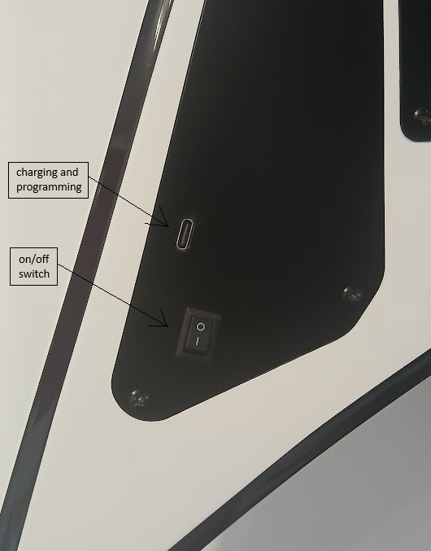
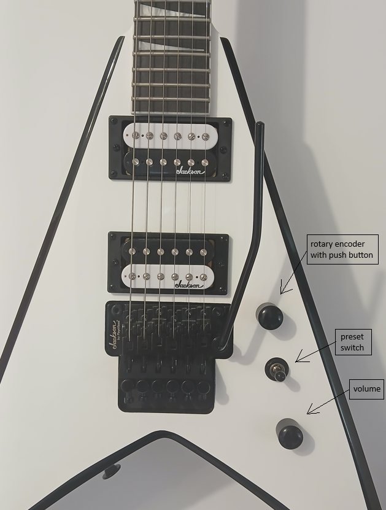

# Valeton GP5 In Guitar Switch

A project for switching the presets on Valeton GP5 multi-effects processor directly from your guitar.
Modifications made to the guitar includes:
- removing tone potentiometer and replacing it with the volume potentiomenter
- installing a rotary encoder with a push button in the place of the volume potentiometer
- rewiring the pickup selector switch and disconnecting the neck pickup
- installing ESP32 C3 board for sending SysEx messages to the GP5 over BLE 

## Images

## How it works

The adapter selection switch is wired to the ESP32-C3 board and is used to select preset switching logic.
The presets in the Valeton GP5 are organized into blocks of 30 positions. The middle 10 presets of each block is reserved for rythm tones and the lower and upper 10 presets can be used for clean and lead tones. The encoder push button initiates the preset switching itself.
When the button is pushed, the SysEx message for preset selection is sent to the GP5 with the preset number calculated with the following logic: 
- Bottom position of the switch: toggles between lower and middle 10 preset blocks 
- Middle position: switches on/off the delay module
- Top posisiton of the switch: toggles between upper and middle 10 preset blocks
For example if your rythm tone is on position 10 and the switch is at the bottom position the push button toggles between preset 10 and preset 0, and if the swich is at the top position the push button toggles between presets 10 and preset 20. So you can have 3 different tones per song and 10 positions for different song settings (30 presets block)

## Hardware

- Seeed Studio XIAO ESP32C3 board
- 500 mAh LiPo battery (lasts at least 5 hours of operation)
- Rotary encoder with push button

## Future

The rotary encoder can be used for preset selection, instead of using the pickup selection switch and disconnecting the bridge pickup.

## License

See LICENSE file for details.